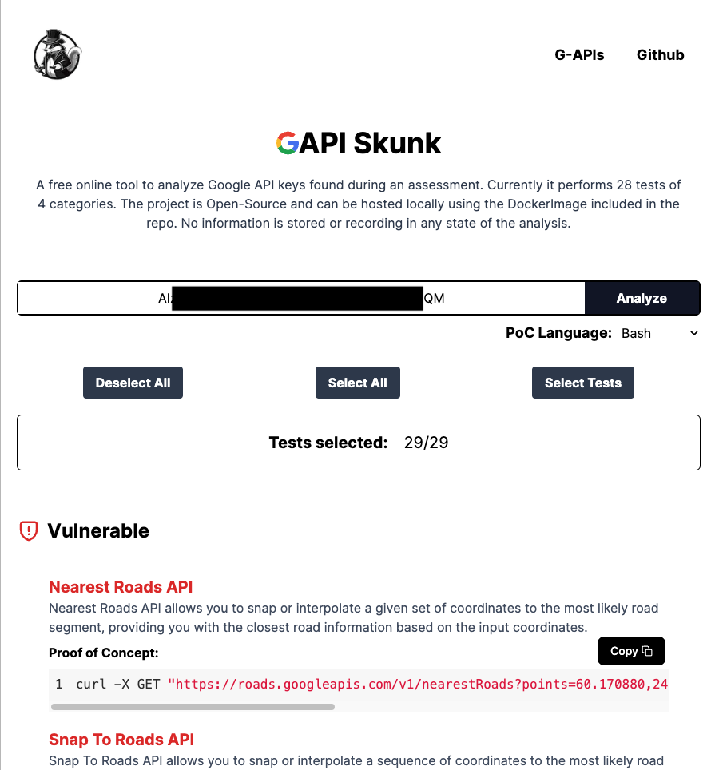
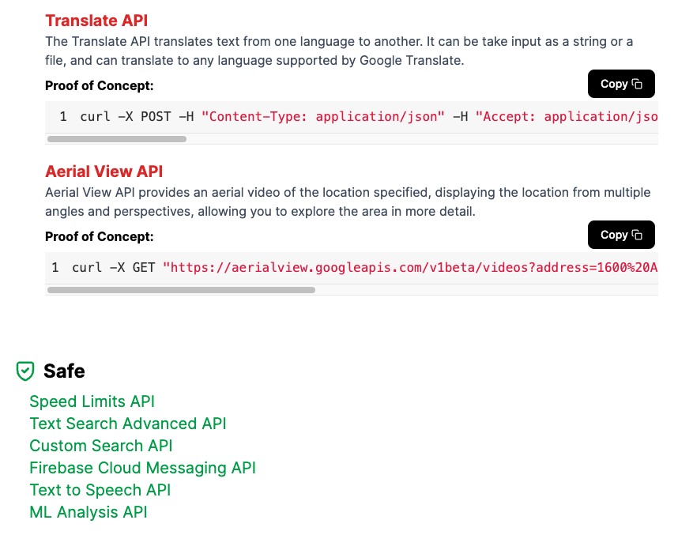

# GAPI Skunk


## Project Description

GAPI Skunk is a tool designed to test the security permissions of a Google API key. It tests the key for potential misconfigurations in permissions across all accessible Google APIs. It performs comprehensive checks to identify excessive permissions, that could lead to unwanted expenses or unauthorized usage. 

The project is hosted on Vercel and can be accessed online, but it can also be self hosted by using the DockerFile provided, or by running the code localy with Node.js.

**No API information is getting stored or shared at any moment**. 


## Web view

[...SNIP...]


## Self Hosting

Build the Docker image. The image is using the official node.js runtime.

``` bash
docker build -t gapi-skunk .
```

Run the application. 

```bash
docker run -it -p 3000:3000 gapi-skunk
```

If you want it to run on a different port ex. 80 update the `-p` agument with `80:3000`.

## Usage

You can access the website directly or use it's API. The API calls are listed below. Each API call can take one optional argument in the url about the language for which the PoC will be displayed. In case the argument `lang` is skipped it will fallback to bash. 


## Features

- Automated scanning for Google API calls
- Detection of key misconfigurations
- Multi-language Proof of Concept codes
- Support for the main 4 Google categories

### Proof of Concept Languages

- Powershell
- Python
- Bash(curl)

### Google Categories

- Maps
- Routes
- Places
- Cloud

### Sample API Call

The API calls require only one item which is the key sent in form of `JSON`. A sample API call is shown below:

```
POST /api/ElevationAPI?lang=powershell HTTP/1.1
Content-Type: application/json
Host: localhost
Content-Length: 49

{
    "key": "AIza[REDACTED]QM"
}


```

Response:
```
{
    "status": "success",
    "poc": "$response = Invoke-WebRequest -Method GET \"https://maps.googleapis.com/maps/api/elevation/json?locations=39.7391536,-104.9847034&key=AIzaS[REDACTED]QM\";$response.Content",
    "language": "powershell"
}
```

#### All API endpoints

- AddressValidationAPI
- ArealViewAPI
- AutocompleteAPI
- ComputeRoutesAPI
- ComputeRoutesMatrixAPI
- CustomSearchAPI
- DirectionsAPI
- DistanceMatrixAPI
- ElevationAPI
- EmbedAdvancedAPI
- EmbedBasicAPI
- FCMAPI
- FindPlaceFromTextAPI
- GeocodeAPI
- GeolocationAPI
- MLAnalysisAPI
- NearbySearchAPI
- NearestRoadsAPI
- PlaceDetailsAPI
- PlacesPhotoAPI
- QueryAutocompleteAPI
- SnapToRoadsAPI
- SpeedLimitsAPI
- StaticMapAPI
- StreetViewAPI
- TextSearchAPI
- TextSearchAdvancedAPI
- TextToSpeechAPI
- TimezoneAPI
- TranslateAPI

## Credits

The idea to develop this solution came from [GAP](https://github.com/joanbono/gap) by joanbono. This was combined with my preference for web apps and my curiosity for Next.js 13.


